# 🧊 Icebreaker: Intelligent Snowflake MCP Agent

> **Navigate Snowflake's complexities, break through data barriers.**
>
> Icebreaker is an advanced Model Context Protocol (MCP) server that empowers AI agents to perform not just queries, but sophisticated administrative, operational, and DataOps tasks directly within Snowflake.

[](https://opensource.org/licenses/MIT)
[](https://www.python.org/downloads/)
[](https://www.snowflake.com/)

---

## 🚀 Why Icebreaker?

While standard Snowflake MCP connectors focus on simple `SELECT` statements for data analysts, **Icebreaker is built for action**. It's designed to be a full-stack DataOps partner for your LLM, capable of understanding and managing your Snowflake environment securely.

| Feature | Standard Connectors | 🧊 Icebreaker Agent |
| :--- | :---: | :---: |
| **Read Data (SELECT)** | ✅ | ✅ |
| **Write Data (INSERT/COPY)**| ❌ | ✅ (Controlled) |
| **Admin Ops (Users/Roles)**| ❌ | ✅ |
| **Cost Ops (Warehouses)** | ❌ | ✅ |
| **Intelligence Layer** | ❌ | ✅ (Explains access, diagnoses errors) |

## 🧠 Conceptual Architecture

Icebreaker doesn't just pass raw SQL. It implements an intelligence layer that translates high-level agent intents into safe, optimized Snowflake operations.

```mermaid
graph LR
    A[AI Agent / LLM] -->|MCP Tool Calls| B(🧊 Icebreaker Server);
    B -->|Validates & Translates Intent| C{Intelligence Layer};
    C -->|Safe SQL Generation| D[Snowflake];
    D -->|Raw Data & Metadata| C;
    C -->|Enriched Context| B;
    B -->|Structured Response| A;
```



## ✨ Key Capabilities (Tools)

Icebreaker exposes high-level tools designed for LLM reasoning, not just SQL execution.

### 🛡️ Operational Intelligence
* `explain_access(user, object)`: Traces RBAC hierarchy to explain *why* a user can see a table.
* `diagnose_query_error(query_id)`: Analyzes failed queries to provide human-readable root cause analysis.

### 💰 FinOps & Compute Management
* `suspend_warehouse(name)` / `resume_warehouse(name)`: Immediate cost control actions.
* `get_warehouse_load(name)`: Check current congestion before scaling.

### 🔧 Data Engineering Ops
* `list_stage_files(stage_pattern)`: Verify data arrival before ingestion.
* `run_safe_copy(table, stage)`: Trigger data loads with built-in error handling options.

---

## ⚡ Quick Start

### Prerequisites
* Python 3.10+
* A Snowflake account with a role capable of the actions you want to automate (e.g., `SYSADMIN` for warehouse ops, or a custom dedicated role).

### Installation

```bash
# Clone the repository
git clone https://github.com/marcoracer/icebreaker.git
cd icebreaker

# Install dependencies (we recommend using uv or venv)
pip install -r requirements.txt
```

### Configuration
Create a `.env` file in the root directory based on `.env.example`:

```ini
SNOWFLAKE_ACCOUNT=your_account_locator
SNOWFLAKE_USER=icebreaker_agent_user
SNOWFLAKE_PASSWORD=secure_password  # Or use Key-Pair auth (recommended for prod)
SNOWFLAKE_ROLE=AGENT_OPS_ROLE
SNOWFLAKE_WAREHOUSE=COMPUTE_WH
```

### Running with Claude Desktop (Example)
Add the following to your `claude_desktop_config.json`:

```json
{
  "mcpServers": {
    "icebreaker": {
      "command": "/path/to/your/venv/bin/python",
      "args": ["/path/to/icebreaker/server.py"]
    }
  }
}
```

---

## 🔒 Security First

Giving an agent administrative powers requires trust. Icebreaker implements several safety guardrails:

* **Least Privilege Intent:** Tools are scoped. A tool designed to `suspend_warehouse` cannot be tricked into executing `DROP DATABASE`.
* **Parameter Validation:** All inputs from the LLM are validated against allowed patterns before becoming SQL.
* **Explicit Write Mode:** Destructive or cost-incurring capabilities must be explicitly enabled via configuration flags.

## 🤝 Contributing

We welcome contributions! Whether it's adding new intelligent tools, improving documentation, or reporting bugs, please feel free to open an issue or submit a PR.

See [CONTRIBUTING.md](CONTRIBUTING.md) for details.

## 📄 License

This project is licensed under the **Mozilla Public License 2.0 (MPL 2.0)** - see the [LICENSE](LICENSE) file for details.
